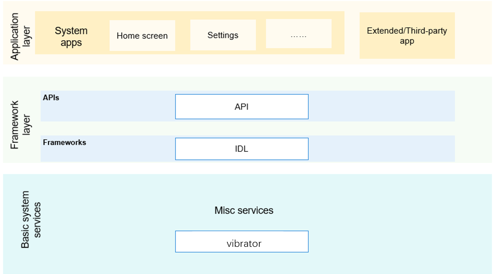

# Timing and Time<a name="EN-US_TOPIC_0000001115554184"></a>

-   [Introduction](#section11660541593)
-   [Directory Structure](#section161941989596)
-   [Repositories Involved](#section1371113476307)

## Introduction<a name="section11660541593"></a>

The vibrator module provides APIs for managing vibrator.

**Figure  1**  Subsystem architecture<a name="fig143011012341"></a>  


## Directory Structure<a name="section161941989596"></a>

```
/base/sensors/time
├── figures                  # Architecture diagram
├── interfaces               # APIs for external systems and applications
│   └── kits                # APIs
```


## Repositories Involved<a name="section1371113476307"></a>

**Sensor subsystem**

sensors\_vibrator

