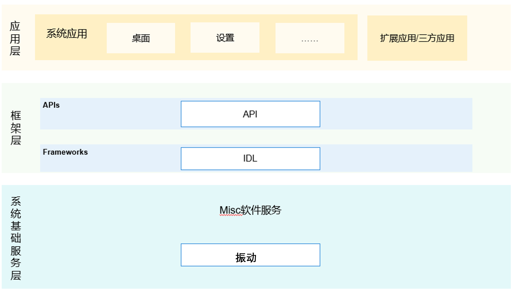

# 振动组件<a name="ZH-CN_TOPIC_0000001115554184"></a>

-   [简介](#section11660541593)
-   [目录](#section161941989596)
-   [相关仓](#section1371113476307)

## 简介<a name="section11660541593"></a>

振动组件提供管理振动的能力。

**图 1**  子系统架构图<a name="fig143011012341"></a>  


## 目录<a name="section161941989596"></a>

```
base/sensors/miscdevice/vibrator
├── figures                  # 构架图
├── interfaces               # 组件对外提供的接口代码
    └── kits                 # 对应用提供的接口

```

## 相关仓<a name="section1371113476307"></a>

**Misc软件服务子系统**

sensors\_vibrator
